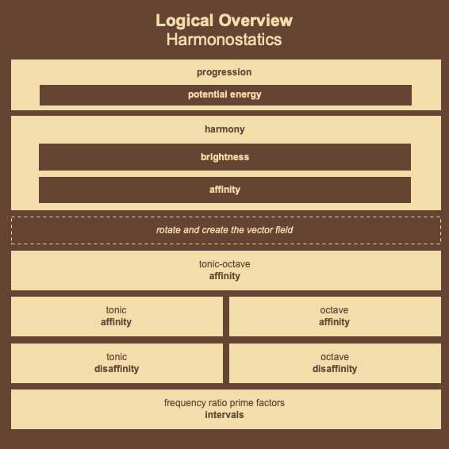

<!-- README.md is generated from README.Rmd. Please edit that file -->

```{r, include = FALSE}
knitr::opts_chunk$set(
  collapse = TRUE,
  comment = "#>",
  fig.path = "man/figures/README-",
  out.width = "100%"
)
```

# harmonostatics

<!-- badges: start -->
[](https://github.com/homeymusic/a_field_theory_of_musical_harmony/actions/workflows/R-CMD-check.yaml)
[](https://codecov.io/gh/homeymusic/a_field_theory_of_musical_harmony)
[](https://github.com/homeymusic/a_field_theory_of_musical_harmony/actions/workflows/test-coverage.yaml)
<!-- badges: end -->

The goal of harmonostatics is to explore a static field theory of musical harmony.


## Logical Overview 



## Installation

You can install the development version of harmonostatics from [GitHub](https://github.com/) with:

``` r
# install.packages("devtools")
devtools::install_github("homeymusic/harmonostatics")
```

## Examples

```{r library}
library(harmonostatics)
```

```{r major_third}
harmony(x=4,home=0,name="Major Third")
```

```{r c_major}
harmony(c(0,4,7),0,"C Major")
```

```{r ionian}
harmony(c(0,2,4,5,7,9,11,12),0,"Major Scale | Ionian Mode")
```

```{r chromatic}
harmony(0:12,0,"Chromatic Scale")
```

```{r potential_energy_I}
potential_energy(c(0,4,7),c(0,4,7),0,"I Ionian - 1st Scale Degree")
```

```{r potential_energy_IV}
potential_energy(c(5,9,12),c(0,4,7),0,"IV Ionian - 4th Scale Degree")
```

```{r potential_energy_V}
potential_energy(c(7,11,14),c(0,4,7),0,"V Ionian - 5th Scale Degree")
```

```{r intervals_affinity_brightness}
title="Affinity & Brightness: Intervals"
intervals = list("tonic"=0,"minor 2nd"=1,"major 2nd"=2,"minor 3rd"=3,
                 "major 3rd"=4,"perfect 4th"=5,"tritone"=6,"perfect 5th"=7,
                 "minor 6th"=8, "major 6th"=9,"minor 7th"=10,"major 7th"=11,
                 "octave"=12)
homey_plot_harmony(intervals,home=0,c("brightness","affinity"),title = title)
```
```{r potential_energy_ionian_tonic_chords}
title="Potential Energy: Major | Ionian Tonic Chords"
ionian_tonic_chords = list("I"=c(0,4,7),
                           "ii"=c(2,5,9),
                           "iii"=c(4,7,11),
                           "IV"=c(5,9,12),
                           "V"=c(7,11,14),
                           "vi"=c(9,12,16),
                           "vii*"=c(11,14,17))
homey_plot_potential_energy(x=ionian_tonic_chords,
                            y=unlist(ionian_tonic_chords[1]),
                            home=0,
                            columns=c("brightness","potential_energy"), 
                            title=title)
```
