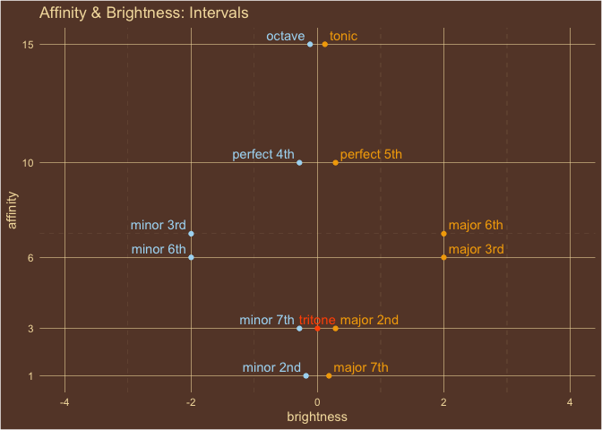

<!-- README.md is generated from README.Rmd. Please edit that file -->

# harmonostatics

<!-- badges: start -->

[](https://github.com/homeymusic/a_field_theory_of_musical_harmony/actions/workflows/R-CMD-check.yaml)
[](https://codecov.io/gh/homeymusic/a_field_theory_of_musical_harmony)
[](https://github.com/homeymusic/a_field_theory_of_musical_harmony/actions/workflows/test-coverage.yaml)
<!-- badges: end -->

The goal of harmonostatics is to explore a static field theory of
musical harmony.

## Logical Overview


## Installation

You can install the development version of harmonostatics from
[GitHub](https://github.com/) with:

``` r
# install.packages("devtools")
devtools::install_github("homeymusic/harmonostatics")
```

## Examples

``` r
library(harmonostatics)
```

``` r
harmony(x=4,home=0,name="Major Third")
#> # A tibble: 1 × 6
#>   semitone intervallic_name name        affinity brightness magnitude
#>      <dbl> <chr>            <chr>          <dbl>      <dbl>     <dbl>
#> 1        4 4                Major Third        6          2      6.32
```

``` r
harmony(c(0,4,7),0,"C Major")
#> # A tibble: 1 × 6
#>   semitone intervallic_name name    affinity brightness magnitude
#>      <dbl> <chr>            <chr>      <dbl>      <dbl>     <dbl>
#> 1     3.67 0:4:7            C Major     7.67      0.801      7.71
```

``` r
harmony(c(0,2,4,5,7,9,11,12),0,"Major Scale | Ionian Mode")
#> # A tibble: 1 × 6
#>   semitone intervallic_name  name                  affinity brightness magnitude
#>      <dbl> <chr>             <chr>                    <dbl>      <dbl>     <dbl>
#> 1     6.25 0:2:4:5:7:9:11:12 Major Scale | Ionian…     6.36      0.558      6.38
```

``` r
harmony(0:12,0,"Chromatic Scale")
#> # A tibble: 1 × 6
#>   semitone intervallic_name             name       affinity brightness magnitude
#>      <dbl> <chr>                        <chr>         <dbl>      <dbl>     <dbl>
#> 1        6 0:1:2:3:4:5:6:7:8:9:10:11:12 Chromatic…     5.31          0      5.31
```

``` r
potential_energy(c(0,4,7),c(0,4,7),0,"I Ionian - 1st Scale Degree")
#> # A tibble: 1 × 7
#>   semitone intervallic_name name  affinity brightness magnitude potential_energy
#>      <dbl> <chr>            <chr>    <dbl>      <dbl>     <dbl>            <dbl>
#> 1     3.67 0:4:7            I Io…     7.67      0.801      7.71                0
```

``` r
potential_energy(c(5,9,12),c(0,4,7),0,"IV Ionian - 4th Scale Degree")
#> # A tibble: 1 × 7
#>   semitone intervallic_name name  affinity brightness magnitude potential_energy
#>      <dbl> <chr>            <chr>    <dbl>      <dbl>     <dbl>            <dbl>
#> 1     8.67 5:9:12           IV I…     7.67      0.801      7.71             22.5
```

``` r
potential_energy(c(7,11,14),c(0,4,7),0,"V Ionian - 5th Scale Degree")
#> # A tibble: 1 × 7
#>   semitone intervallic_name name  affinity brightness magnitude potential_energy
#>      <dbl> <chr>            <chr>    <dbl>      <dbl>     <dbl>            <dbl>
#> 1     10.7 7:11:14          V Io…     7.67      0.801      7.71             61.5
```

``` r
title="Affinity & Brightness: Intervals"
intervals = list("tonic"=0,"minor 2nd"=1,"major 2nd"=2,"minor 3rd"=3,
                 "major 3rd"=4,"perfect 4th"=5,"tritone"=6,"perfect 5th"=7,
                 "minor 6th"=8, "major 6th"=9,"minor 7th"=10,"major 7th"=11,
                 "octave"=12)
homey_plot_harmony(intervals,home=0,c("brightness","affinity"),title = title)
```



``` r
title="Potential Energy: Major | Ionian Tonic Chords"
ionian_tonic_chords = list("I"=c(0,4,7),
                           "ii"=c(2,5,9),
                           "iii"=c(4,7,11),
                           "IV"=c(5,9,12),
                           "V"=c(7,11,14),
                           "vi"=c(9,12,16),
                           "vii*"=c(11,14,17))
homey_plot_potential_energy(x=ionian_tonic_chords,
                            y=unlist(ionian_tonic_chords[1]),
                            home=0,
                            columns=c("brightness","potential_energy"), 
                            title=title)
```


