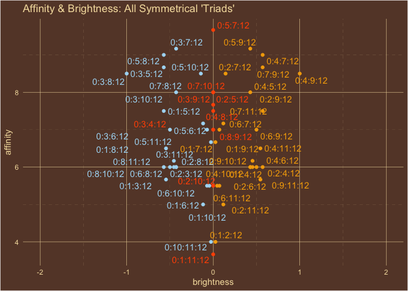
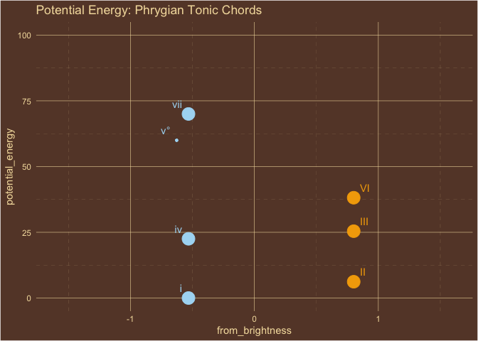
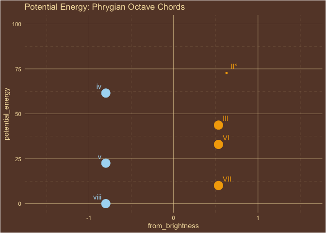

<!-- README.md is generated from README.Rmd. Please edit that file -->

# harmonostatics

<!-- badges: start -->

[](https://github.com/homeymusic/a_field_theory_of_musical_harmony/actions/workflows/R-CMD-check.yaml)
[](https://codecov.io/gh/homeymusic/a_field_theory_of_musical_harmony)
[](https://github.com/homeymusic/a_field_theory_of_musical_harmony/actions/workflows/test-coverage.yaml)

<!-- badges: end -->

The goal of harmonostatics is to explore a static field theory of
musical harmony.

## Logical Overview


## Installation

You can install the development version of harmonostatics from
[GitHub](https://github.com/) with:

``` r
# install.packages("devtools")
devtools::install_github("homeymusic/harmonostatics")
```

## Examples

The
[tests](https://github.com/homeymusic/harmonostatics/tree/main/tests/testthat)
include additional examples.

``` r
library(harmonostatics)
```

``` r
title="Affinity & Brightness: Intervals"
intervals = list("tonic"=0,"minor 2nd"=1,"major 2nd"=2,"minor 3rd"=3,
                 "major 3rd"=4,"perfect 4th"=5,"tritone"=6,"perfect 5th"=7,
                 "minor 6th"=8, "major 6th"=9,"minor 7th"=10,"major 7th"=11,
                 "octave"=12)
homey_plot_harmony(intervals,home=0,c("brightness","affinity"),
                   title=title,pascal_triangle=TRUE)
```


``` r
title="Affinity & Brightness: All Symmetrical 'Triads'"
chords = utils::combn(1:11,2,function(x){c(0,x,12)},simplify=FALSE)
homey_plot_harmony(chords,columns=c("brightness","affinity"),title=title,
                   include_names=FALSE,repel_labels=TRUE)
```



``` r
title="Affinity & Brightness: Diatonic Modes"
diatonic_modes = list(
  "locrian"=c(0,1,3,5,6,8,10,12),
  "phrygian"=c(0,1,3,5,7,8,10,12),
  "aeolian"=c(0,2,3,5,7,8,10,12),
  "dorian"=c(0,2,3,5,7,9,10,12),
  "mixolydian"=c(0,2,4,5,7,9,10,12),
  "ionian"=c(0,2,4,5,7,9,11,12),
  "lydian"=c(0,2,4,6,7,9,11,12)
)
homey_plot_harmony(diatonic_modes,home=0,c("brightness","affinity"),
                   title=title)
```


``` r
title="Potential Energy: Tonic Intervals"
intervals = list("tonic"=0,"minor 2nd"=1,"major 2nd"=2,"minor 3rd"=3,
                 "major 3rd"=4,"perfect 4th"=5,"tritone"=6,"perfect 5th"=7,
                 "minor 6th"=8, "major 6th"=9,"minor 7th"=10,"major 7th"=11,
                 "octave"=12)
homey_plot_potential_energy(x=intervals,
                            y=unlist(intervals[1]),
                            home=0,
                            columns=c("semitone","potential_energy"), 
                            title=title,symmetrical=FALSE,x_expansion_mult=0.1,y_lim_max=160)
```


``` r
title="Potential Energy: Ionian (Major) Tonic Chords"
ionian_tonic_chords = list("I"=c(0,4,7),
                           "ii"=c(2,5,9),
                           "iii"=c(4,7,11),
                           "IV"=c(5,9,12),
                           "V"=c(7,11,14),
                           "vi"=c(9,12,16),
                           "vii\u00B0"=c(11,14,17))
homey_plot_potential_energy(x=ionian_tonic_chords,
                            y=unlist(ionian_tonic_chords[1]),
                            home=0,
                            columns=c("brightness","potential_energy"), 
                            title=title,y_lim_max=100)
```


``` r
title="Potential Energy: Phrygian Tonic Chords"
phrygian_tonic_chords = list("i"=c(0,3,7),
                             "II"=c(1,5,8),
                             "III"=c(3,7,10),
                             "iv"=c(5,8,12),
                             "v\u00B0"=c(7,10,13),
                             "VI"=c(8,12,15),
                             "vii"=c(10,13,17))
homey_plot_potential_energy(x=phrygian_tonic_chords,
                            y=unlist(phrygian_tonic_chords[1]),
                            home=0,
                            columns=c("brightness","potential_energy"), 
                            title=title,y_lim_max=100)
```



``` r
title="Potential Energy: Aeolian Tonic Chords"
aeolian_tonic_chords = list("i"=c(0,3,7),
       "ii\u00B0"=c(2,5,8),
       "III"=c(3,7,10),
       "iv"=c(5,8,12),
       "v"=c(7,10,14),
       "VI"=c(8,12,15),
       "VII"=c(10,14,17))
homey_plot_potential_energy(x=aeolian_tonic_chords,
                            y=unlist(aeolian_tonic_chords[1]),
                            home=0,
                            columns=c("brightness","potential_energy"), 
                            title=title,y_lim_max=100)
```


``` r
title="Potential Energy: Octave Intervals"
intervals = list("tonic"=0,"minor 2nd"=1,"major 2nd"=2,"minor 3rd"=3,
                 "major 3rd"=4,"perfect 4th"=5,"tritone"=6,"perfect 5th"=7,
                 "minor 6th"=8, "major 6th"=9,"minor 7th"=10,"major 7th"=11,
                 "octave"=12)
homey_plot_potential_energy(x=intervals,
                            y=unlist(intervals[13]),
                            home=12,
                            columns=c("semitone","potential_energy"), 
                            title=title,symmetrical=FALSE,x_expansion_mult=0.1,y_lim_max=160)
```


``` r
title="Potential Energy: Phrygian Octave Chords"
phrygian_octave_chords = list("viii"=c(12,8,5),
                              "VII"=c(3,7,10),
                              "VI"=c(1,5,8),
                              "v"=c(0,3,7),
                              "iv"=c(5,1,-2),
                              "III"=c(3,0,-4),
                              "II\u00B0"=c(1,-2,-5))
homey_plot_potential_energy(x=phrygian_octave_chords,
                            y=unlist(phrygian_octave_chords[1]),
                            home=12,
                            columns=c("brightness","potential_energy"), 
                            title=title,y_lim_max=100)
```



``` r
harmony(x=4,home=0,name="Major Third")
#> # A tibble: 1 × 7
#>   semitone intervallic_name name  affinity brightness brightness_pola… magnitude
#>      <dbl> <chr>            <chr>    <dbl>      <dbl>            <dbl>     <dbl>
#> 1        4 4                Majo…        6          2                1      6.32
```

``` r
harmony(c(0,4,7),0,"C Major")
#> # A tibble: 1 × 7
#>   semitone intervallic_name name  affinity brightness brightness_pola… magnitude
#>      <dbl> <chr>            <chr>    <dbl>      <dbl>            <dbl>     <dbl>
#> 1     3.67 0:4:7            C Ma…     7.67      0.801                1      7.71
```

``` r
harmony(c(0,2,4,5,7,9,11,12),0,"Ionian Mode (Major Scale)")
#> # A tibble: 1 × 7
#>   semitone intervallic_name name  affinity brightness brightness_pola… magnitude
#>      <dbl> <chr>            <chr>    <dbl>      <dbl>            <dbl>     <dbl>
#> 1     6.25 0:2:4:5:7:9:11:… Ioni…     6.36      0.558                1      6.38
```

``` r
harmony(0:12,0,"Chromatic Scale")
#> # A tibble: 1 × 7
#>   semitone intervallic_name name  affinity brightness brightness_pola… magnitude
#>      <dbl> <chr>            <chr>    <dbl>      <dbl>            <dbl>     <dbl>
#> 1        6 0:1:2:3:4:5:6:7… Chro…     5.31          0                0      5.31
```

``` r
potential_energy(c(0,4,7),c(0,4,7),0,"I Ionian")
#> # A tibble: 1 × 7
#>   semitone intervallic_name name  affinity brightness magnitude potential_energy
#>      <dbl> <chr>            <chr>    <dbl>      <dbl>     <dbl>            <dbl>
#> 1     3.67 0:4:7            I Io…     7.67      0.801      7.71                0
```

``` r
potential_energy(c(5,9,12),c(0,4,7),0,"IV Ionian")
#> # A tibble: 1 × 7
#>   semitone intervallic_name name  affinity brightness magnitude potential_energy
#>      <dbl> <chr>            <chr>    <dbl>      <dbl>     <dbl>            <dbl>
#> 1     8.67 5:9:12           IV I…     7.67      0.801      7.71             22.5
```

``` r
potential_energy(c(7,11,14),c(0,4,7),0,"V Ionian")
#> # A tibble: 1 × 7
#>   semitone intervallic_name name  affinity brightness magnitude potential_energy
#>      <dbl> <chr>            <chr>    <dbl>      <dbl>     <dbl>            <dbl>
#> 1     10.7 7:11:14          V Io…     7.67      0.801      7.71             61.5
```
